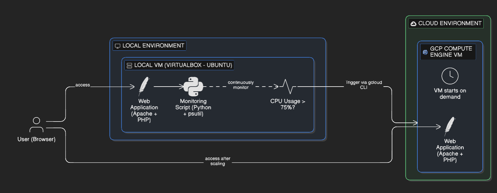

# VCC Assignment 3: Create a Local VM and Auto-Scale to Google Cloud Platform when Resource Usage Exceeds 75% in Local VM

## Overview

This project demonstrates a **Hybrid Cloud Scaling** mechanism where a local virtual machine automatically triggers a cloud virtual machine when system resource usage exceeds a defined threshold. The implementation simulates a real-world **cloud bursting scenario**, where local infrastructure is extended to public cloud resources during high load conditions.

## Objective

- Monitor CPU usage on a Local VM
- Trigger a Cloud VM when CPU usage exceeds 75%
- Deploy the same application on both environments
- Demonstrate hybrid cloud scaling behavior

## Architecture

## System Components

### 1. Local VM (VirtualBox)
- Ubuntu-based virtual machine
- Hosts monitoring script
- Runs sample web application

### 2. Monitoring Script
- Implemented in Python using `psutil`
- Continuously checks CPU usage
- Triggers cloud VM via GCP CLI

### 3. Google Cloud Platform (GCP)
- Compute Engine VM
- Hosts same application
- Activated on-demand

### 4. Sample Application
- PHP-based web page
- Displays:
  - Hostname
  - IP Address
  - Execution environment
  - Scaling status

## Workflow

1. Application runs on Local VM
2. Monitoring script checks CPU usage every 5 seconds
3. If CPU > 75%:
   - Script triggers GCP VM
4. Cloud VM starts automatically
5. Application becomes available on cloud

## Technologies Used

- VirtualBox (Local Virtualization)
- Google Cloud Platform (Compute Engine)
- Python (Monitoring Script)
- psutil (CPU Monitoring)
- Apache + PHP (Web Application)
- GitHub (Version Control)

## Key Features

- Threshold-based scaling (CPU > 75%)
- Automated cloud resource provisioning
- Real-time monitoring
- Hybrid cloud architecture demonstration
- Lightweight and efficient implementation

## How to Run

Refer to: deployment/steps.md

## Results

- Successfully triggered GCP VM based on local CPU usage
- Verified application deployment on both environments
- Demonstrated hybrid scaling mechanism effectively

## Conclusion

This project demonstrates how local infrastructure can dynamically extend to cloud environments based on resource utilization. It provides a practical understanding of hybrid cloud scaling and resource management.

### Name: Shrusti Jain  
### Roll No: M25CSE030  